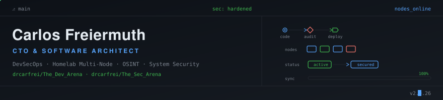

Como **CTO y Arquitecto de Software**, me especializo en diseñar e implementar arquitecturas de software resilientes, auditar seguridad ofensiva e integrar entornos auto-hospedados (Homelab). Mi enfoque abarca desde la conceptualización de sistemas distribuidos hasta el hardening de infraestructura crítica.

---

### Tecnologías & Áreas de Trabajo

* **Arquitectura de Software:** Diseño Guiado por el Dominio (DDD), microservicios, diseño de APIs REST/gRPC y patrones de resiliencia.
* **Seguridad & Pentesting:** Análisis de vulnerabilidades, auditorías de seguridad, OSINT y hardening de entornos.
* **DevOps e Infraestructura:** Linux (Debian, Parrot OS), Docker, NGINX, redes mesh con Tailscale y automatización de despliegues.
* **Homelab & Auto-hospedaje:** Gestión de clústeres multi-nodo bare-metal, despliegue de ERPs (Dolibarr) y LLMs locales (Ollama/Qwen).
* **Lenguajes & Tecnologías Core:** JavaScript/Node.js, GDScript (Godot Engine), SQLite, SQL Server, HTML5/CSS3.

---

### Repositorios Destacados

* **[The_Dev_Arena](https://github.com/drcarfrei/The_Dev_Arena):** Laboratorio principal de desarrollo de software, experimentos de arquitectura, utilidades en Node.js y algoritmos.
* **[The_Sec_Arena](https://github.com/drcarfrei/The_Sec_Arena):** Repositorio dedicado a auditorías de seguridad, guías de pentesting, herramientas de OSINT y prácticas de hacking ético.

---

### Metodología de Trabajo

* **Seguridad por diseño:** La seguridad no es una capa posterior; se integra desde el primer boceto de arquitectura.
* **Infraestructura soberana:** Control total sobre datos y servicios mediante soluciones auto-hospedadas y redes privadas seguras.
* **Documentación como código:** Cada decisión de diseño, registro de cambios y mapa de red se documenta con la misma rigurosidad que el código fuente.

---

### Actividad & Estadísticas

  
  

---

### Más Allá de la Pantalla

* **Pixel Art & Gamedev:** Ilustración digital de 8/16/32-bits, animaciones e implementación de assets en Godot Engine.
* **Música:** Batería, guitarra y técnica vocal.
* **Redacción:** Autor independiente enfocado en narrativa de ficción y análisis técnico.

---

### Contacto

¿Tienes una alianza estratégica, auditoría de seguridad o proyecto de arquitectura de software en mente?

* **LinkedIn:** [carlos-freiermuth](https://www.linkedin.com/in/carlos-freiermuth/)
* **Correo:** [carlosfreiermuth@gmail.com](mailto:carlosfreiermuth@gmail.com)
* **Línea Directa:** [+593 99 944 8906](https://wa.me/593999448906)
